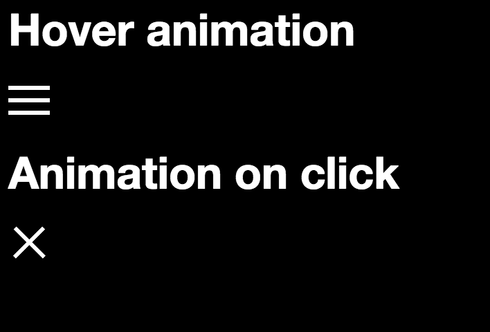

# CSS Menu Icon!
**The classic hamburger icon to cross animation - done in pure CSS!**

No pre-processor, JavaScript, or anything - just simple CSS3 is all you need to have a modern menu icon!

I’ve done two easy-to-use variants: For animation on hover, and animate on click using HTML checkbox.

## License
Cba to pick one. But it’s free - free I say! Use it as you will.  A little kudos goes a long way though ;)
Enjoy!!